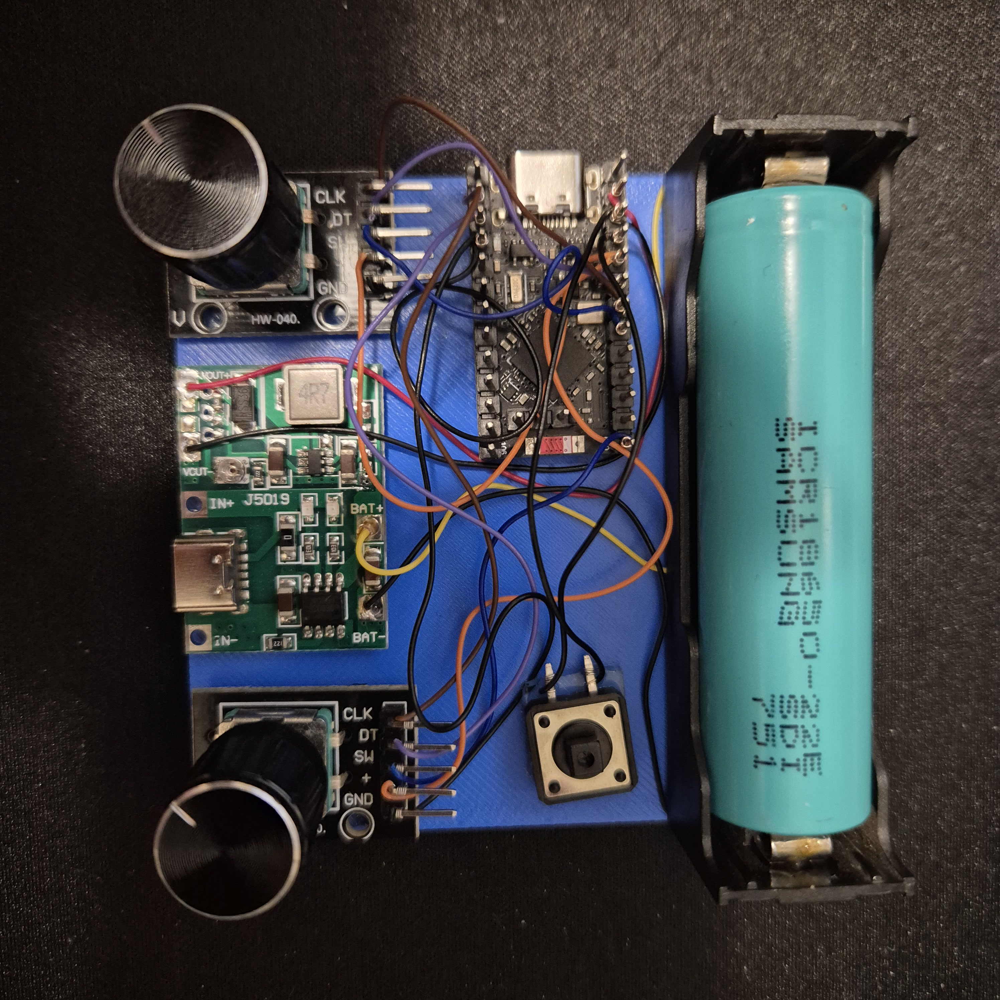

# ZMK Controller Pad

A Bluetooth media controller built with ZMK, a Pro Micro nRF52840 board compatible with nice!nano, and two off-the-shelf HW-040 / KY-040 rotary encoder modules.

This project is intended as a simple, reproducible DIY controller pad: volume on one encoder, track controls on the other, and Bluetooth HID media keys for desktop and mobile operating systems.



Demo video: [media/demo.mp4](media/demo.mp4)

## Search Keywords

ZMK, controller pad, Bluetooth media controller, Pro Micro nRF52840, nice!nano, nRF52840, HW-040, KY-040, rotary encoder, EC11, volume knob, media keys, HID keyboard, UF2 firmware.

## What It Does

| Control | Action |
| --- | --- |
| Volume encoder clockwise | Volume up |
| Volume encoder counterclockwise | Volume down |
| Volume encoder press | Mute/unmute |
| Track encoder clockwise | Next track |
| Track encoder counterclockwise | Previous track |
| Track encoder press | Play/pause |

The repository and project name is `ZMK Controller Pad`. The Bluetooth advertising name is shorter because ZMK enforces a 16-character BLE name limit:

```text
ZMK Ctrl Pad
```

## Hardware

- Pro Micro nRF52840 board compatible with nice!nano.
- Two HW-040 / KY-040 rotary encoder modules.
- One normally-open momentary reset pushbutton.
- USB-C data cable.
- Optional LiPo 1S battery if your board exposes `B+` and `B-` pads.
- Optional external LiPo charger/boost module, depending on the final enclosure and power design.

## Wiring

Use 3.3 V for the encoder modules. Do not connect 5 V to `VCC` / `VDD`.

| Function | Module pin | Board pin |
| --- | --- | --- |
| Volume encoder ground | `GND` | `GND` |
| Volume encoder power | `+` | `VCC` / `VDD` 3.3 V |
| Volume encoder A | `CLK` | `029` |
| Volume encoder B | `DT` | `031` |
| Volume encoder switch | `SW` | `002` |
| Track encoder ground | `GND` | `GND` |
| Track encoder power | `+` | `VCC` / `VDD` 3.3 V |
| Track encoder A | `CLK` | `006` |
| Track encoder B | `DT` | `008` |
| Track encoder switch | `SW` | `009` |
| Reset button | one side | `RST` |
| Reset button | other side | `GND` |

Reset wiring:

```text
RST -> momentary button -> GND
```

Double-tap reset to enter the UF2 bootloader.

## Build Locally

This repository does not use GitHub Actions. Firmware is built locally with Docker.

Requirements:

- Docker installed and running.
- Git available in the terminal.

Build:

```bash
./scripts/build-local.sh
```

Output:

```text
firmware/zmk_controller_pad.uf2
```

If your board needs a different ZMK board name:

```bash
BOARD=nice_nano_v2 ./scripts/build-local.sh
```

## Flash Firmware

1. Connect the board over USB.
2. Double-tap the reset button.
3. Wait for a bootloader volume named `NICENANO`, `NRF52BOOT`, or similar.
4. Run:

```bash
./scripts/flash-local.sh
```

The board should reboot automatically after the UF2 file is copied.

## Pair Over Bluetooth

1. Open your operating system Bluetooth settings.
2. Search for `ZMK Ctrl Pad`.
3. Pair it as a keyboard/HID device.
4. Test both encoders.

If the device was already paired under a previous name, remove the old pairing and scan again.

## Documentation

- [Getting started, wiring, build, and flashing](docs/getting-started.md)
- [Media assets](media/README.md)

## Repository Structure

```text
.
├── boards/shields/zmk_controller_pad/
├── config/
├── docs/
├── media/
├── scripts/
├── build.yaml
└── README.md
```

## License

MIT. See [LICENSE](LICENSE).
